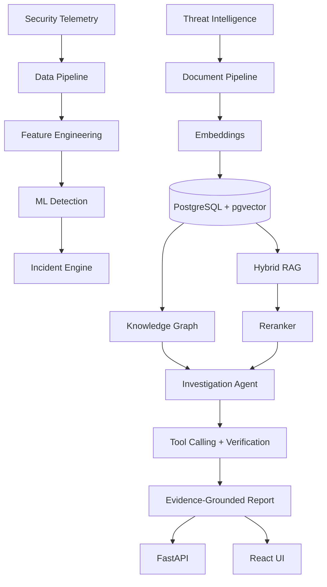

# SENTINEL-X


**AI-Powered Security Incident Intelligence & Autonomous Investigation Platform**

SENTINEL-X detects abnormal enterprise activity with ML, correlates related security events into incidents, retrieves evidence from a threat-intelligence knowledge base via hybrid RAG, reasons over an entity knowledge graph, and runs a tool-using investigation agent that produces **evidence-grounded incident reports with measurable confidence**.

## Architecture



## Technology stack

| Layer | Technology |
|---|---|
| Language | Python 3.12, TypeScript |
| ML | scikit-learn, XGBoost, PyTorch (Transformer encoder), Isolation Forest |
| Retrieval | PostgreSQL FTS (BM25-style) + pgvector HNSW + RRF fusion + cross-encoder reranking |
| LLM | Ollama + Qwen2.5 3B (local) |
| Backend | FastAPI, SQLAlchemy 2 (async), JWT auth, RBAC |
| Database | PostgreSQL 16 + pgvector |
| MLOps | MLflow, GitHub Actions CI, Docker Compose |
| Observability | structlog structured logging |

## Quickstart

### Full stack (Docker)

```powershell
docker compose up -d          # postgres+pgvector, redis, mlflow, api, web
# API      -> http://localhost:8001/docs   (host port 8001; 8000 stays free for other services)
# UI       -> http://localhost:5173
# MLflow   -> http://localhost:5000
```

### Local development

```powershell
# 1. Create environment and install
python -m venv .venv
.\.venv\Scripts\Activate.ps1
pip install -e ".[dev]"

# 2. Start infrastructure (PostgreSQL+pgvector, Redis)
docker compose up -d postgres redis

# 3. Configure environment
Copy-Item .env.example .env

# 4. Seed the pipeline: events -> ML-scored incidents -> knowledge graph
python scripts/seed_pipeline.py --reset
```

## Evaluation & experiments

Every claim in this project is backed by a runnable experiment under `experiments/`.
**Measured results** (full methodology + limitations in [`docs/experiments/results-2026-08.md`](docs/experiments/results-2026-08.md)):

- **Retrieval:** hybrid+reranker achieves best MRR **0.627** / NDCG@10 **0.879** vs 0.213 / 0.245 for BM25-only
- **RAG ablation (n=25, local 3B model):** hybrid+reranker raises faithfulness to **0.500** (+13.6% rel.) and answer relevance to **0.405** (+17% rel.) vs vector-only RAG; BM25-only RAG collapses to 0.20 faithfulness
- **Knowledge graph:** attack hosts reach IOC nodes within 2 hops at **33.3%** vs **0.0%** for benign controls — perfect separation at hop radius ≥ 2

| Experiment | Measures |
|---|---|
| `experiments/retrieval/` | Recall@K / MRR / NDCG for BM25 vs vector vs hybrid vs hybrid+reranker |
| `experiments/ablations/run_rag_ablation.py` | Context precision/recall + faithfulness across retrieval configurations |
| `experiments/ablations/run_graph_eval.py` | Multi-hop host-to-IOC path hit-rate, attack vs benign hosts |
| `src/sentinel_x/evaluation/agents/harness.py` | Investigation agent task success, tool-call accuracy, latency |

## Repository layout

```text
apps/api          FastAPI application
apps/web          React + TypeScript dashboard
src/sentinel_x/   Core Python package
  data/           Ingestion, normalization, canonical schemas
  ml/             Features, training, models, inference
  retrieval/      BM25, vector, hybrid fusion, reranking
  rag/            Document ingestion, context building, generation
  graph/          Entity extraction, relationships, traversal
  incidents/      Correlation engine and risk scoring
  agents/         Planner, tools, workflows, verification
  evaluation/     ML / retrieval / RAG / agent metrics
experiments/      Reproducible experiment entry points
configs/          Configuration files
infrastructure/   Docker and deployment assets
docs/             Architecture notes, experiment reports, research
```

## Status

Active development. See `docs/architecture/` for design decisions and `docs/experiments/` for measured results.

## License

MIT

